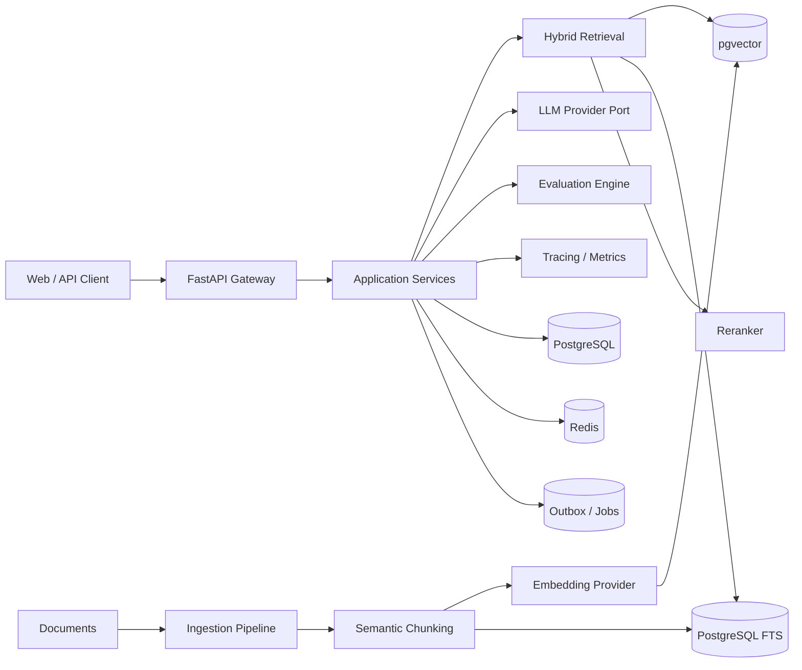

# AtlasRAG

**Production-minded Retrieval-Augmented Generation platform for trustworthy enterprise knowledge assistants.**

AtlasRAG is designed as a portfolio-grade AI system that demonstrates the engineering work required *around* an LLM: ingestion, retrieval quality, reranking, citations, evaluation, observability, reliability, cost control, and clean service boundaries.

> This repository is an engineering simulation/reference implementation. It does not claim production traffic, proprietary data, or compliance certification.

## Why this project exists

A useful RAG system is not just `embed -> vector search -> prompt`. AtlasRAG treats retrieval and generation as measurable pipelines with explicit contracts and failure modes.

The platform is being built around these questions:

- Can every answer show where its evidence came from?
- Can retrieval quality be measured independently from generation quality?
- Can the system detect when evidence is weak and abstain rather than hallucinate?
- Can providers/models be swapped without rewriting business logic?
- Can we understand latency, token cost, retrieval hit-rate, and failure causes?
- Can ingestion and query processing scale independently when needed?

## Target architecture



## Engineering pillars

### Retrieval quality
- hybrid dense + lexical retrieval
- metadata filtering
- reranking
- query rewriting / decomposition
- configurable top-k
- evidence score thresholds

### Trust and evaluation
- source citations
- abstention when context is insufficient
- retrieval precision/recall metrics
- groundedness and answer-relevance evaluation
- regression evaluation datasets
- deterministic test doubles for model providers

### Production concerns
- multi-tenant boundaries
- provider abstraction
- durable ingestion jobs
- idempotent document processing
- structured errors
- rate limiting / quotas
- caching
- tracing, metrics, structured logs
- Docker and CI

## Initial API

```text
GET  /health
POST /v1/query
```

Example:

```bash
curl -X POST http://localhost:8000/v1/query \
  -H 'Content-Type: application/json' \
  -d '{
    "question": "How does AtlasRAG reduce hallucinations?"
  }'
```

The first milestone uses deterministic in-memory retrieval so the domain and API behavior are fully testable without external AI credentials. Later milestones replace infrastructure behind stable interfaces.

## Roadmap

- [x] architecture and product contract
- [x] query API with deterministic retrieval
- [x] citation-first response model
- [x] evaluation primitives (precision/recall@k and MRR)
- [ ] PostgreSQL + pgvector retrieval persistence
- [x] durable PostgreSQL document ingestion + deterministic chunking
- [ ] hybrid lexical/vector search
- [ ] reranking
- [ ] OpenAI/compatible provider adapter
- [ ] local/open-source provider adapter
- [ ] Redis cache + rate limiting
- [ ] background ingestion worker
- [ ] multi-tenant auth
- [ ] OpenTelemetry + Prometheus
- [ ] evaluation dashboard
- [ ] adversarial/failure tests
- [ ] polished web UI + live demo

## Portfolio signal

AtlasRAG is intentionally designed to demonstrate:

- LLM/RAG engineering beyond API wrappers
- information retrieval fundamentals
- backend architecture and clean boundaries
- evaluation-driven AI development
- reliability and observability
- testable provider abstractions
- practical system-design trade-offs

## License

MIT
